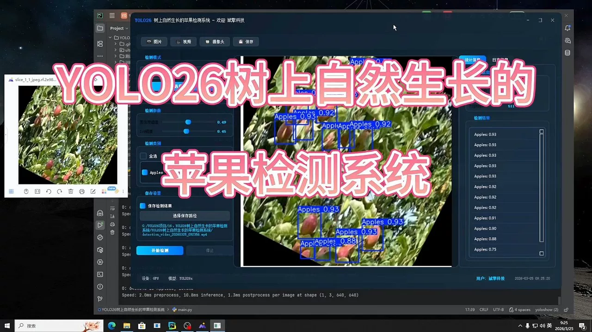
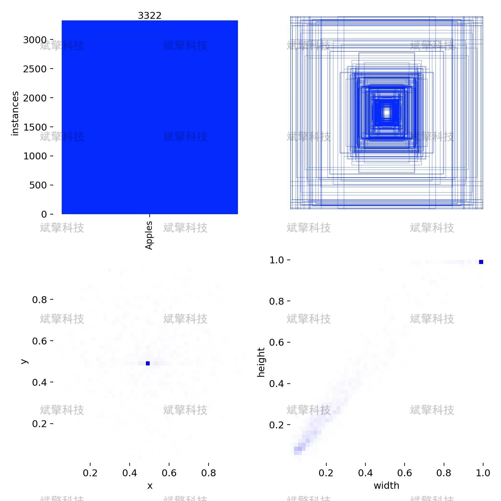
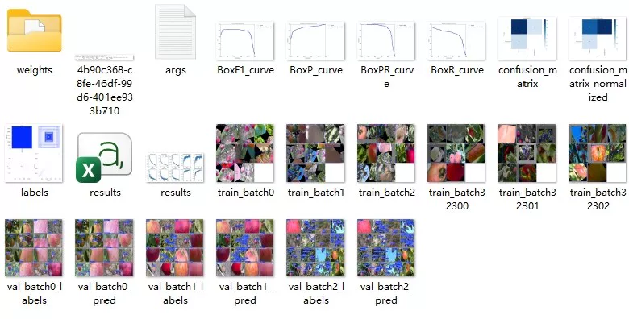
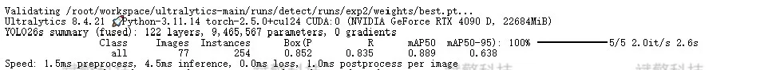
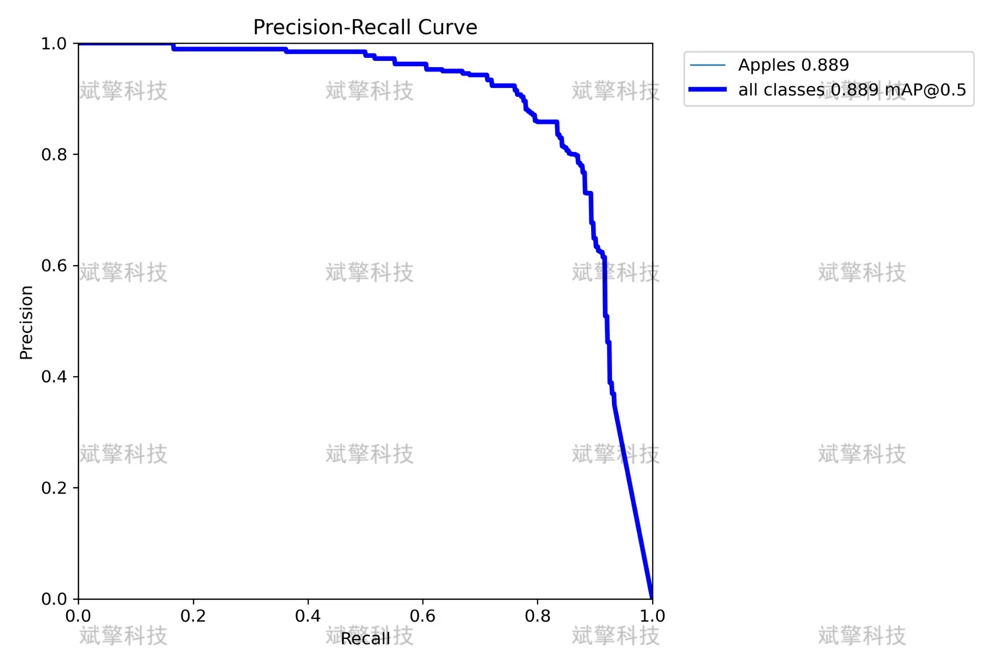
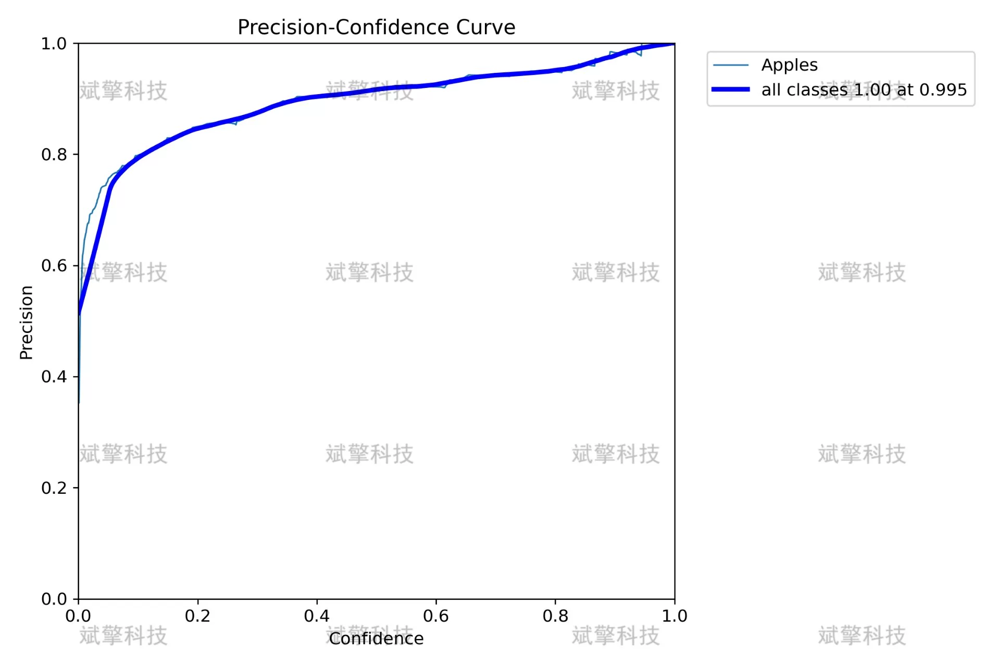
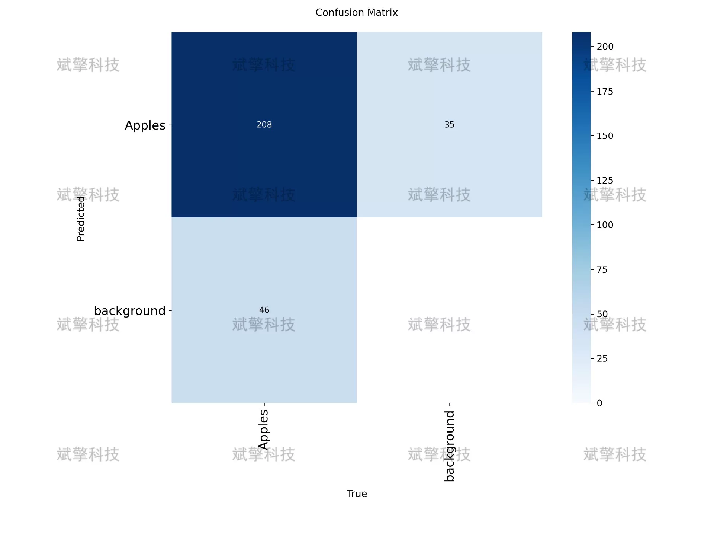
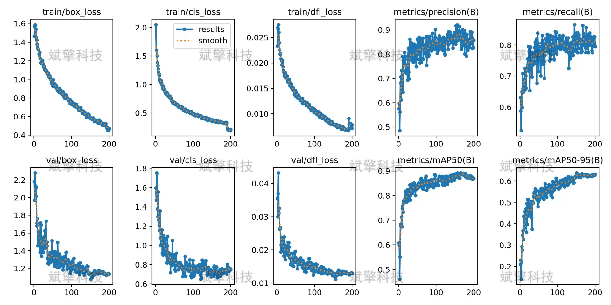
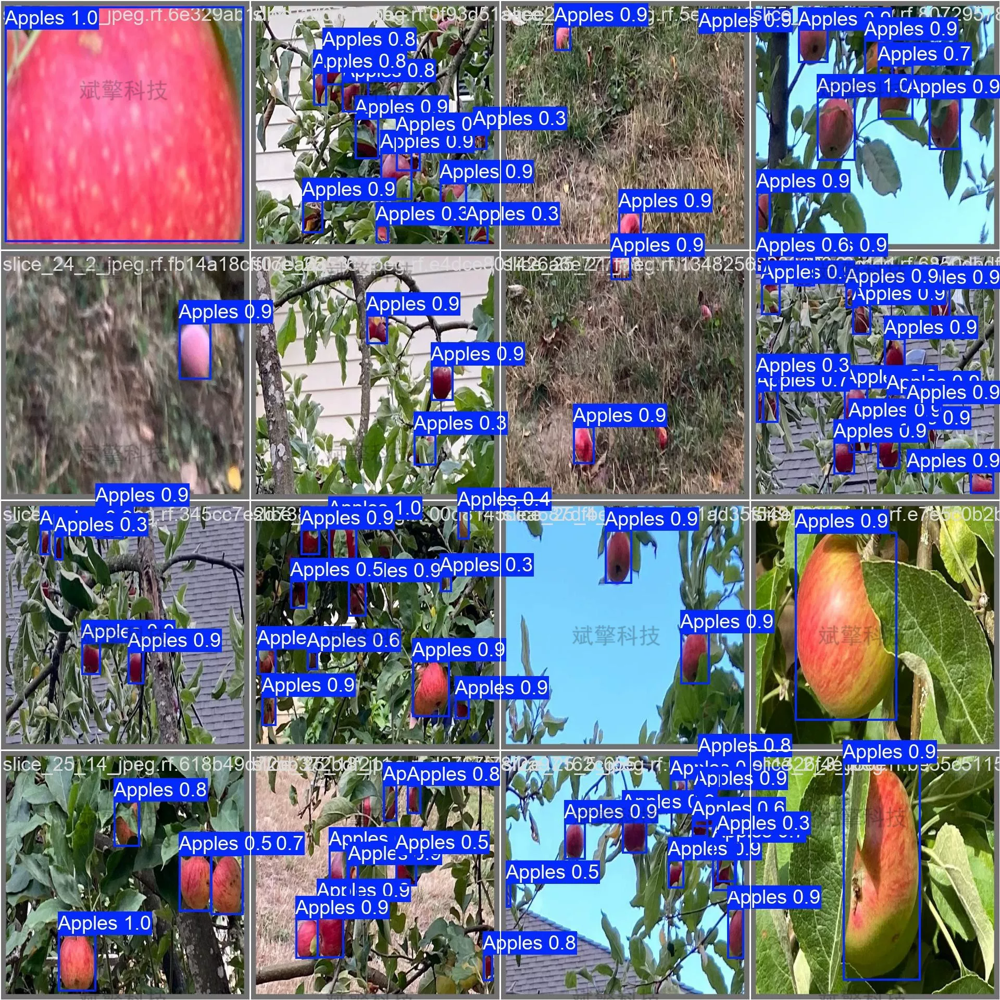

# YOLOv26 tree-based self-staining growth apple detection system

## Body

YOLO26, a tree-based self-pollinated apple detection system for complex natural environments based on YOLO26

This paper addresses the issue of automatic detection of apples on trees in natural environments. A highly efficient apple detection system was constructed based on the YOLO26 object detection algorithm. The study used a self-built apple dataset, including 1355 training images, 77 validation images, and 39 test images, with annotations for apple categories. The experimental results show that the model achieved an accuracy of 0.852, recall of 0.835, and mAP50 of 0.889 on the validation set, with a maximum F1 score of 0.84. Through confusion matrix analysis, the correct detection rate of the model for apples is 82%, and the background false alarm rate is 18%. This system can effectively identify apples in their natural growth state, providing reliable technical support for intelligent management of orchards.

The apple detection dataset used in this study consists of 1471 images, specifically divided into:
Training set: 1355 images (92.1%)
Validation set: 77 images (5.2%)
Test set: 39 images (2.7%)
The dataset is a single-class detection task, with the category name being 'Apples', and a total of 254 apple instances (verified set statistics) have been labeled.

Free reservation for remote installation. Unsuccessful full refund.
Purchase enjoy the following resources (Baidu Drive unlock automatically):
YOLO recognition detection project complete source code
YOLO format dataset
Training code + UI interface code
Trained model + result images
Software install package
Add WeChat to make a reservation for remote installation (automatically displayed WeChat ID after purchase) - Unsuccessful, full refund

⚙️ Core function modules
Detection capability
Image detection: upload and detect immediately, returning detection boxes + category information
Video detection: supports video files, analyzing each frame accurately
Camera real-time detection: connect USB camera, achieving dynamic monitoring
Interaction and control
Target selection: freely choose one or more categories for detection
Parameter real-time adjustment: adjustable confidence threshold & IoU threshold, flexible control of precision
Result saving: image/video/camera detection results saved instantly
System and data
User login registration: Support password strength detection + encryption storage
Log recording: automatically records operation and error information (timestamped)

## Images

## Payment

Here is a pay link on Stripe ( https://buy.stripe.com/3cs8yP7sY87d0vu9AB ). Please contact me lonlonago@foxmail.com after funding $89, and I will send you a complete data files , thank you!

